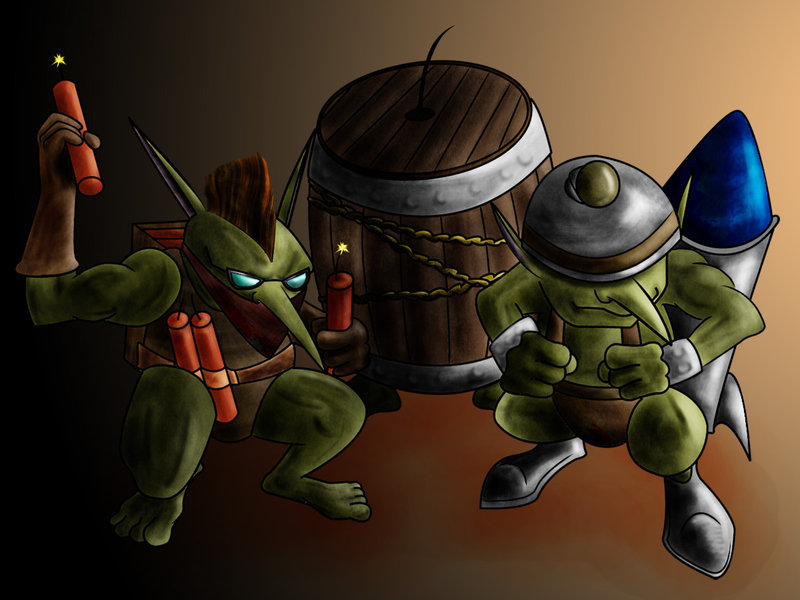

# Goblin



Goblin is a database written in pure Java. It's an experimental project to help us understand the database's principle.

## AIMS:
* SQL Engine
* Columnar Storage
* Various Index
* SIMD Vectorized Operation
* ...

## Core Dependencies:
* CALCITE
* GUAVA
* NETTY
* ARROW
* ...


## Getting Started

### Requires:
* JAVA-18
* MAVEN-3.6.3

### Steps:
* You must change the path of project's root, and exec maven's command.
```sh
cd ${project-path}
./mvnw clean compile
```

* You run a Java's application in the development integration environment, such as: IDEA.
```java
com.wojustme.goblin.server.GoblinStartup.main
```

